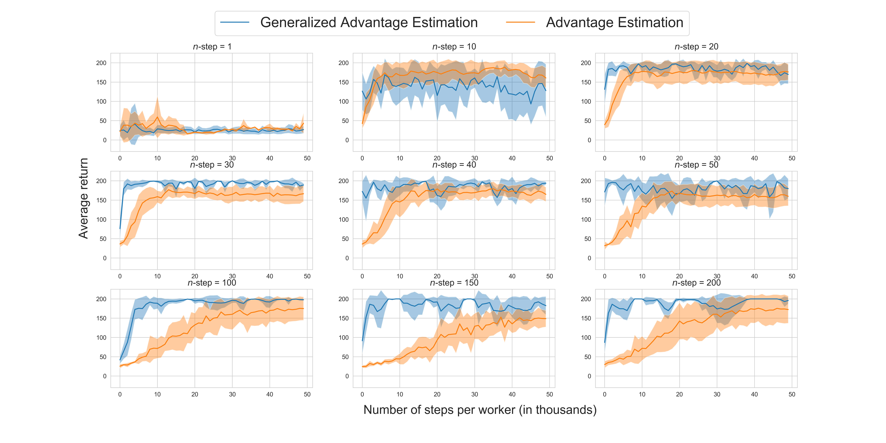

# Measuring the Effect of Advantage Estimation in Actor-Critic methods
*By Noah van Grinsven, Anton Steenvoorden, Tessa Wagenaar, Laurens Weitkamp.*


For the reinforcement learning course at the UvA we are given the task of creating reproducible research, where we can choose from a number of topics. We have chosen to focus on $n-$step bootstrapping in actor-critic methods, which traditionally exhibit high variance for higher $n$ and high bias for lower $n$. In specific, we want to compare variance reduction methods such as the advantage estimation and the generalized advantage estimation. This naturally leads to the following question:

*What is the effect of (generalized) advantage estimation on the return in $n$-step bootstrapping?*

This blog post is meant to answer that question. First, we will give a quick overview of actor critic methods, $n$-step bootstrapping and the (generalized) advantage function. Second, we will discuss our setup which involves a detailed explanation of how the results can be reproduced. Third, we will give an analysis of the results which should answer the question above. Our code base can be found <a href="https://github.com/lweitkamp/Reproducibility_GAE">here</a>, which is inspired by other implementations[^2][^3].

## Actor Critic Methods and Advantage Estimation

In reinforcement learning we typically want to maximize the total expected reward, which can be done using various methods. We can for example choose to learn the value function(s) for each state and infer the policy from this, or learn the policy directly through parameterization of the policy. Actor critic methods combine the two approaches: the actor is a parameterized policy which outputs matches the number of actions ($a_t \in \mathcal{A}$), the critic learns the value for each state through bootstrapping[^4]:
$$
\begin{align*}
\nabla_{\boldsymbol{\theta}} J(\boldsymbol{\theta})&= \mathbb{E}\left[ \sum_{t=0}^\infty \nabla_\theta \log \pi_\theta (a_t|s_t) \big(r_{t} + \gamma \hat{v}(s_{t+1})  \big)\right] \\
&= \mathbb{E}\left[ \sum_{t=0}^\infty \nabla_\theta \log \pi_\theta (a_t|s_t)\hat{q}(s_t, a_t)\right]
\end{align*}
$$
This estimate is however biased (due to bootstrapping) and can exhibit high variance (a common problem in policy gradient based methods). Bias is hard to tackle, but we can reduce variance through the introduction of the advantage function $\hat{A}$:
$$
\begin{align*}
\nabla_{\boldsymbol{\theta}} J(\boldsymbol{\theta})&= \mathbb{E}\left[ \sum_{t=0}^\infty \nabla_\theta \log \pi_\theta (a_t|s_t) \hat{A}\right] \\
\nabla_{\boldsymbol{\theta}} J(\boldsymbol{\theta})&= \mathbb{E}\left[ \sum_{t=0}^\infty \nabla_\theta \log \pi_\theta (a_t|s_t) \big(\hat{q}(s_t, a_t) - \hat{v}(s_t))\right]
\end{align*}
$$
The Advantage function tells us how good an action $a$ was in state $s$ compared to other actions we could have taken, so it tells us what the *advantage* of taking this action. If the action taken in state $s$ leads to a high return, we would like to increase the probability of taking that action in state $s$.

### N-step bootstrapping

Monte carlo based methods have one big disadvantage: we have to wait for the end of an episode to perform a backup. We can tackle this disadvantage by performing $n$-step bootstrapping with $n \in \mathbb{Z}$. There is ofcourse no free lunch, and performing boostrapping does have the effect of (possibly) inducing bias to our estimate (this is especially true for $n$ close to 1). If we combine actor-critic methods with $n-$step learning and advantage estimation, it is commonly known as advantage actor critic (A2C). 

In code, estimating the advantage function through bootstrapping looks like this:

```python
def A(next_value, rewards, values, gamma):
    values = values + [next_value] # we need an extra value for bootstrapping Qsa
    returns = []
    for step in reversed(range(len(rewards))):
        Qsa = rewards[step] + gamma * values[step + 1]
        Vs  = values[step]
        A = Qsa - Vs
        returns.insert(0, A)

    return returns
```

Where the rewards and values are vectors of size $\mathbb{R}^n$, and hence we go through the list in reverse order to properly discount each reward.

### Generalized Advantage Estimation

We now turn to an idea proposed in the paper *High Dimensional Continuous Control Using Generalized Advantage Estimation*[^1] by Schulman et al. 2016. The advantage function reduces variance, but the authors claim we can do better: learn an exponentially-weighted estimator of the advantage function. This is what they call Generalized Advantage Estimation:
$$
\hat{A}^{\text{GAE}(\gamma, \lambda)}_t = \sum^{\infty}_{l=0} (\gamma \lambda)^{l} \delta^V_{t+l}
$$
Where $\delta^V_{t} = r_t + \gamma V(s_{t+1}) - V(s_t)$ is the bootstrapped estimate for $\hat{A}_t$. The parameter $0 < \lambda < 1$ governs a trade-off between variance ($\lambda \approx 1$) and bias $(\lambda \approx 0)$. this is ***bias on top of bias***! But the authors note that it is a bias we can permit, as it reduces the variance to such a degree to enable quick learning. Additionally, the authors note that it is desireable to set $\lambda << \gamma$ as to balance bis and variance. In code, it looks like this:

```python
def GAE(next_value, rewards, values, gamma, GAE_lambda):
    values = values + [next_value]
    gae = 0
    returns = []
    for step in reversed(range(len(rewards))):
        Qsa = rewards[step] + gamma * values[step + 1]
        Vs  = values[step]
        delta = Qsa - Vs

        gae = delta + gamma * GAE_lambda * gae
        returns.insert(0, gae)
    
    return returns
```

Not *that* different when compared to the vanilla version, which makes it easy to implement.

## Setup 

To answer our research question "*What is the effect of (generalized) advantage estimation on the return in $n$-step bootstrapping?*", we will vary the learning rate over different $n$-step bootstrapping methods. 
When we have found the optimal learning rates for the $n$-step bootstrapping methods, we will compare the results of these methods with each other to determine the performance of the Advantage and Generalized Advantage Estimation as critics in an actor-critic algorithm. 

### Environments

For our experiment we have chosen to use the CartPole-v0, and the MountainCar-v0 environments of the OpenAI gym python package.

The CartPole-v0 environment has two actions, namely push left and push right. The goal is to balance a pole on top of a cart (hence cartpole) for as long as possible (maximum of 200 time steps) and the input our agent receives is a vector of four values: pole position, cart velocity, pole angle and pole velocity at tip. A video of the environment with a random policy can be seen below on the left hand side.

The MountainCar-v0 environment has three actions, namely push left, no push and push right. The goal is to push the car up the mountain and an episodes finishes when either this happens, or when 200 time steps have passed. Our agent receives an input vector of 2 values: the car's position and velocity. A video of the environment with a random policy can be seen below on the left hand side. Note that the agent gets no reward for going up the left side of the hill (but a steady -1 return for each step).

<div style="width:100%; display:table;">
<div style="float: left; width:49%">
<video controls autoplay loop="loop"  style="width:100%"><source src="https://gym.openai.com/videos/2019-10-08--6QXvzzSWoV/CartPole-v1/thumbnail.mp4" type="video/mp4"></video>
</div>
<div style="float: left; width:49%">
<video controls autoplay loop="loop" style="width:100%"><source src="https://gym.openai.com/videos/2019-10-08--6QXvzzSWoV/MountainCar-v0/thumbnail.mp4" type="video/mp4"></video> 
</div>
</div>
*Videos taken from [OpenAI Gym](https://gym.openai.com)* 

These environments were chosen for their simplicity, while still having a quite large state space. More difficult environments have not been tested due to the limited time available for this project. 

### Actor-critic Implementation

We train the agent using a deep neural network where the input is transformed into shared features (a vector in $\mathbb{R}^{30}$), from which two heads form: the actor ($\in \mathbb{R}^{|\mathcal{A}|}$) and critic output ($\in \mathbb{R}$). A code snippet in PyTorch can be seen below, note that the output for the actor is a Softmax.

```python
import torch.nn as nn

class ActorCriticMLP(nn.Module):
    def __init__(self, input_dim, n_acts, n_hidden=32):
        super(ActorCriticMLP, self).__init__()
        self.input_dim = input_dim
        self.n_acts = n_acts
        self.n_hidden = n_hidden

        self.features = nn.Sequential(
            nn.Linear(self.input_dim, self.n_hidden),
            nn.ReLU(),
        )

        self.value_function = nn.Sequential(
            nn.Linear(self.n_hidden, 1)
        )
        self.policy = nn.Sequential(
            nn.Linear(self.n_hidden, n_acts),
            nn.Softmax(dim=0)
        )

    def forward(self, obs):
        obs = obs.float()
        obs = self.features(obs)
        probs = self.policy(obs)
        value = self.value_function(obs)
        return probs, value
```

In our experiment we performed a grid search over the learning rate and the n-step return. 
For gamma we took $0.99$ and for the lambda in GAE we took $0.97$, these values come recommended in the original paper for GAE[^1].

### Parameter search

The experiment first searches for the optimal learning rate for each $n$-step. The various numbers of $n$ are: $n \in \{1, 10, 20, 30, 40, 50, 100, 150, 200\}$. Note that $n=200$ corresponds to the MC estimate for both CartPole and MountainCar (as both environments terminate when reaching $t = 200$). 

As learning rate for the regular Advantage Estimation we use $lr_A \in \{0.001, 0.003, 0.005, 0.007, 0.009, 0.01\}$.
For the Generalized Advantage Estimation we use  $lr_{GAE} \in \{0.01, 0.03, 0.05, 0.07\}$. 

GAE uses a larger learning rate, because it reduces the variance more than the Advantage Estimation. This makes it able to use larger updates than the normal Advantage Estimation. 

The search for these optimal parameters is qubic, as we iterate over 3 separate parameters, namely $n$, $lr$ and pytorch random seeds. To speed up the experiment we use multi-threaded agents where 16 environments were played at the same time, all with their own seeds. Additionally, multi-threading leads to better estimates of the gradient and reduces variance, allowing for a higher learning rate and improving convergence. 

### Reproducibility

To ensure reproducibility, we have manually set the seeds for pytorch and the gym environments. 
We use in total 5 seeds, namely $[0, 30, 60, 90, 120]$, for _PyTorch_ and *NumPy*. The environments use seeds 16 to 31, where the seeds are determined by the number of workers (environment instances) we have. In our case this is 16, the seeds are calculated as followed:

```seeds = [i + num_envs for i in range(num_envs)]```

## Results and Analysis

To determine which setup works best, we first combine the results of all the seeds, sorted by return type, $n$ used in $n$-steps and learning rate. We then calculate the mean over the rewards, and use this to determine which the best setup per return type.

|                                     | $n = 1$      | $n = 10$ | $n = 20$ | $n = 30$ | $n = 40$ | $n = 50$   | $n = 100$              | $n = 150$  | $n = 200$ |
| ----------------------------------- | ------------ | -------- | -------- | -------- | -------- | ---------- | ---------------------- | ---------- | --------- |
| **Generalized Advantage Estmation** | 0.03         | 0.01     | 0.01     | 0.01     | 0.03     | 0.01, 0.05 | 0.01, 0.03, 0.07, 0.09 | 0.03, 0.07 | 0.03      |
| **Advantage Estimation**            | 0.001, 0.003 | 0.001    | 0.01     | 0.009    | 0.005    | 0.007      | 0.007                  | 0.005      | 0.009     |

> *[Table 1](#best_lr): Optimal learning rate per $n$-step. When there are multiple values present in a cell, the results were similar up to 1.0 difference in the return. An example for GAE, $n=150$; 0.03 yields a return of $180.7$ whereas 0.05 yields a return of $181.8$*.


In [table 1](#best_lr) we see that [todo]


{#avg_returns }
> *[Figure 1](#avg_returns): These results are for the CartPole-v0 environment. We show results for the best learning rate of the GAE and AE returns. The graphs show the mean with surrounding it one standard deviation. The $n=x$ labels refer to the $n$-step bootstrapping. The axis label "Number of steps (in thousands) refers to the steps taken in the environment themselves, and needs to also be multiplied by the number of agents. The y-axis is averaged over the seeds and the rewards observed at 1000-step interval.*

Our graphs in [Figure 1](#avg_returns) show that GAE does not work for low values of $n$, we think this is due to the bias that is added by GAE, whilst already being biased. AE sometimes does manage to get high returns, because it is less biased, however displays very high variance. 

With $n=10$ GAE already has higher rewards and lower variance, however we see that from $n=20$ onwards it really starts to perform consistently good. This is not the case for regular AE, which seems to be harmed by larger values of $n$. 

When $n>50$, it becomes more like Monte Carlo methods, which we can see as it learns slower, this is due to the higher variance MC methods have. Also, it waits longer to backup, which slows the online learning down.  

When $n=200$ we are fully Monte Carlo, and what we see is that the variance is really reduced to a minimum, even though MC methods are inherently high variance. This shows that GAE is able to really reduce the variance, and is quite remarkable.


## Conclusion

Our results indicate that..

n < 10 : GAE results are bad [why?], this is probably due to the high bias of doing a one step bootstrap

n > 10: Learning rates could be set higher for GAE, This is due to the lowering variance properties of GAE in combination with the bias reduction of a higher $n$. 

Now it is important to keep in mind that the way these methods are tested is quite limited. In this experiment the returns showed are averaged over a total of 5 seeds, which could give misleading results. 

Also, specific for this environment, good to try these methods on other environments.


[^1]:  Schulman, J., Moritz, P., Levine, S., Jordan, M., & Abbeel, P. (2015). High-dimensional continuous control using generalized advantage estimation. *arXiv preprint arXiv:1506.02438*.
[^2]: https://github.com/pytorch/examples/blob/master/reinforcement_learning/actor_critic.py
[^3]: https://github.com/ikostrikov/pytorch-a3c
[^4]: Actually, bootstrapping is what defines actor critic methods when contrasted to vanilla policy gradient methods.